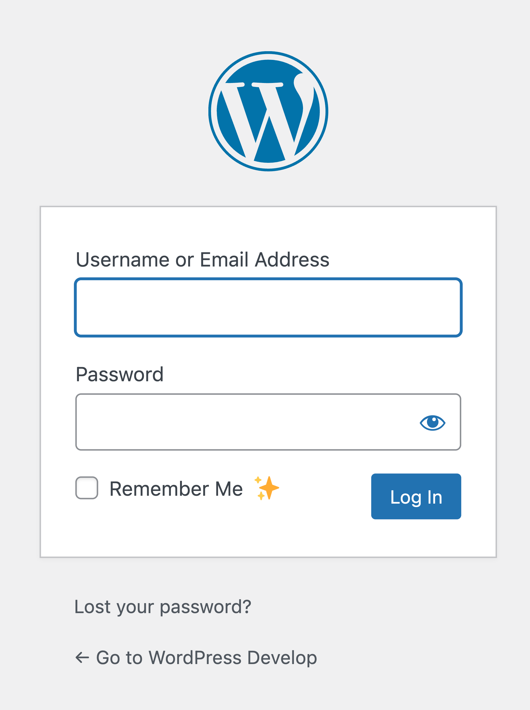
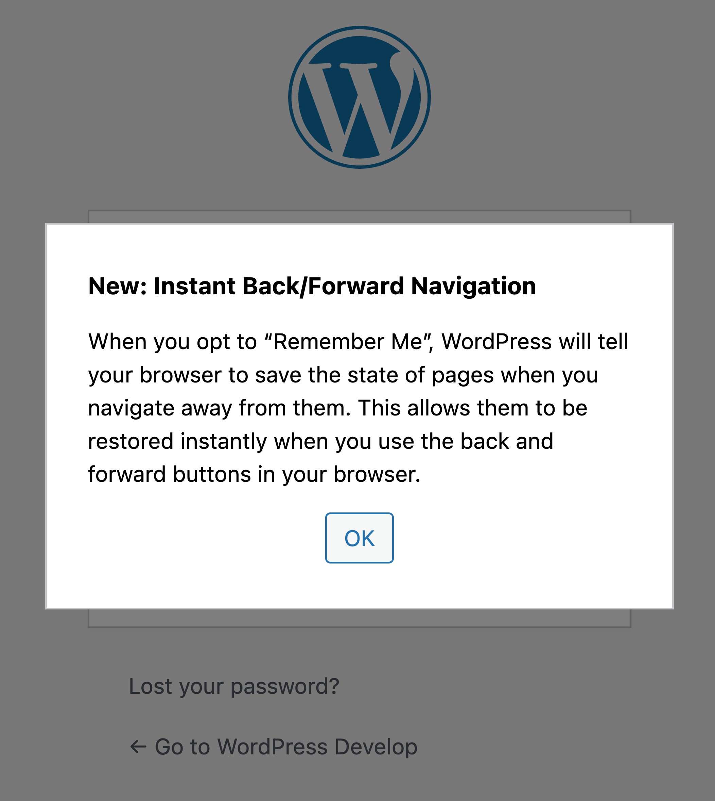
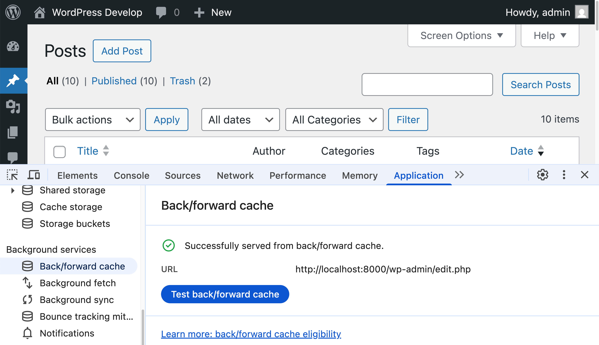

# No-cache BFCache

Enables back/forward cache (bfcache) for instant history navigations even when "nocache" headers are sent, such as when a user is logged in.


**Contributors:** [westonruter](https://profile.wordpress.org/westonruter)  
**Tags:**         performance, caching  
**Tested up to:** 6.8  
**Stable tag:**   1.0.0  
**License:**      [GPLv2 or later](https://www.gnu.org/licenses/old-licenses/gpl-2.0.html)

## Description

This plugin enables instant back/forward browser navigation when a user is logged in. **Upon activation, to see the effect, you must log out and log back in again, ensuring "Remember Me" is checked.** Even so, another plugin may be active which makes pages [ineligible for bfcache](https://web.dev/articles/bfcache#optimize). See the [FAQ](#faq).

Learn about [Back/forward cache](https://web.dev/articles/bfcache) on web.dev and via the following video:

[](https://youtu.be/Y2IVv5KnrmI)

Normally, WordPress sends a `Cache-Control` header with the `no-store` directive when a user is logged in. This has the effect of [breaking the browser's bfcache](https://web.dev/articles/bfcache#minimize-no-store), which means that navigating back or forward in the browser requires the pages to be re-fetched from the server and for any JavaScript on the page to re-execute. The result can be a sluggish navigation experience not only when navigating around the WP Admin (see [Jetpack demo video](https://github.com/Automattic/jetpack/pull/44322#:~:text=page%20load%20is%3A-,Without%20bfcache,-With%20bfcache)) but also when navigating around the frontend of a site. Furthermore, the lack of bfcache can cause data loss when data has been entered via a JavaScript-built UI since this state is lost when a page is not restored via bfcache (see [WooCommerce demo video](https://github.com/woocommerce/woocommerce/pull/58445#issuecomment-3014404754)).

Note that Chrome [may even now](https://developer.chrome.com/docs/web-platform/bfcache-ccns) store pages served with `no-store` in bfcache, although there are still failure scenarios in which bfcache will still be blocked. These can be observed in the "Back/forward cache" panel in the Application tab of Chrome DevTools, for example:

* `JsNetworkRequestReceivedCacheControlNoStoreResource`: JavaScript on a page makes a request to a resource served with the `no-store` directive (e.g. REST API or admin-ajax).
* `CacheControlNoStoreCookieModified`: JavaScript on a page modifies cookies.

These scenarios happen frequently when browsing the WP Admin, and they occur frequently on the frontend when using plugins like WooCommerce or BuddyPress. Such bfcache failures can also occur when not being logged in to WordPress, as it can happen whenever a site calls `nocache_headers()`. For example, WooCommerce currently calls `nocache_headers()` when an unauthenticated user is on the Cart, Checkout, or My Account pages (but see [woocommerce#58445](https://github.com/woocommerce/woocommerce/pull/58445) which proposes removing this). These failure scenarios do not occur when the `no-store` directive is omitted from the `Cache-Control` header.

This plugin strips out the `no-store` directive when it is present while ensuring that the `private` directive is sent in its place. (If your site absolutely needs `no-store` for some reason, then don't use this plugin.) The reason behind why the `no-store` directive was added in the first place was to prevent proxies from caching private page responses. However, there is the more appropriate [`private` directive](https://developer.mozilla.org/en-US/docs/Web/HTTP/Reference/Headers/Cache-Control#private) for this purpose:

> The `private` response directive indicates that the response can be stored only in a private cache (e.g., local caches in browsers).
>
> You should add the `private` directive for user-personalized content, especially for responses received after login and for sessions managed via cookies.
>
> If you forget to add `private` to a response with personalized content, then that response can be stored in a shared cache and end up being reused for multiple users, which can cause personal information to leak.

This is in contrast with the [`no-store` directive](https://developer.mozilla.org/en-US/docs/Web/HTTP/Reference/Headers/Cache-Control#no-store) which prevents caching by proxies _and_ by the browser's bfcache:

> The `no-store` response directive indicates that any caches of any kind (private or shared) should not store this response.

In addition to replacing `no-store` with `private`, this plugin also adds `no-cache`, `max-age=0`, and `must-revalidate` and ensures `public` is removed all to further guard against any misconfigured proxy from caching the private response.

There is one additional reason for why the `no-store` directive is used and that is due to a potential privacy issue where an authenticated user may log out of WordPress, only for another person to access the computer and click the back button in order to view the contents of the authenticated page loaded from the bfcache. (See [#21938](https://core.trac.wordpress.org/ticket/21938).) In practice this issue depends on the user being on a shared computer, and it also requires the malicious user to act soon since the bfcache has a timeout ([10 minutes](https://developer.chrome.com/docs/web-platform/bfcache-ccns#:~:text=The%20bfcache%20timeout%20for%20Cache%2DControl%3A%20no%2Dstore%20pages%20is%20also%20reduced%20to%203%20minutes%20(from%2010%20minutes%20used%20for%20pages%20which%20don%27t%20use%20Cache%2DControl%3A%20no%2Dstore)%20to%20further%20reduce%20risk.) in Chrome for pages sent without `no-store`).

In order to address this privacy concern, two safeguards are in place to protect against restoring pages from bfcache after the user has logged out:

1. When accessing the login screen (including the interim login re-auth modal), a message is broadcast (via `BroadcastChannel`) which is listened to on all authenticated pages. In Chrome, Edge, and Firefox, when a page in bfcache receives a message via Broadcast Channel, it is evicted and a [`broadcastchannel-message`](https://developer.mozilla.org/en-US/docs/Web/API/Performance_API/Monitoring_bfcache_blocking_reasons#broadcastchannel-message) blocking reason is reported. This behavior has been [proposed](https://github.com/whatwg/html/issues/7253#issuecomment-2632953500) for standardization, and only Safari appears to not have implemented this yet.
2. When authenticating to WordPress, a "bfcache session token" cookie is sent along with the other authentication cookies. This cookie is not HTTP-only so that it can be read in JavaScript; it is a random string not used for any other purpose. When an authenticated page is served, a script is included which reads the value of this cookie. When a user navigates away from the page and then navigates back to it, a `pageshow` event handler checks to see if it was restored from bfcache. If so, it checks the latest value of the cookie; when the value doesn't match, the contents of the page are cleared, and the page is reloaded so that the contents are not available. This is the only bfcache invalidation method supported by Safari. It is also a fallback bfcache invalidation method for other browsers which support the Broadcast Channel method, or if the user logs out in a non-standard way: If a user logs out and does not land on the login screen, then the eviction message is not broadcast. This can happen when "switching off" in the User Switching plugin; this can also happen if the user manually deleted cookies or the cookies expired.

Since JavaScript is required to invalidate bfcache, the login form is extended to pass along whether scripting is enabled. Only when JS is enabled will the `no-store` directive be omitted from the `Cache-Control` response header. This ensures that users with JavaScript turned off will retain the privacy protection after logging out.

There is another privacy scenario not handled by this plugin: reopening closed tabs for authenticated pages. It turns out that recently closed tabs are not put into the bfcache but are stored in the browser's HTTP cache. This means the JavaScript heap is not restored when the tab is re-opened (at least not in browsers currently); the `persisted` property of the `pageshow` event object is `false`, and all JavaScript is re-executed. Some form fields that had been populated with unsubmitted data _may_ be restored by the browser in the same way as they are restored when navigating back/forward for pages served with `no-store` directive, but browsers differ on to what degree they restore this session information. In particular, only static form fields served with the initial HTML may be restored; any form fields generated with JavaScript will not get any data restored. So this is partial privacy protection for re-opened closed tabs. This being said, Chromium issue [40052728](https://issues.chromium.org/issues/40052728) proposes putting closed tabs in bfcache:

> ClosedTabCache aims to make the "Reopen Closed Tab" button instant for recently closed tabs. It will rely on functionality from BackForwardCache for Chrome. The main use case for this project is users accidentally closing tabs and wanting to restore them shortly after. Performance gains are expected if we are able to restore these tabs instantly with all their content.

At one time (in 2020) this was even implemented and [made available](https://9to5google.com/2020/07/02/google-chrome-reopen-closed-tab-instant/) behind a “Closed Tab Cache” flag in Chrome, but this is no longer available. Therefore, since there is not a reliable way to invalidate cached pages in closed browser tabs, the ability for pages served by WordPress to be stored in bfcache currently uses the “Remember Me” checkbox as the opt-in. (Nevertheless, this additional privacy safeguard may be excessive.) A ✨ emoji is displayed next to the checkbox in a button that opens a popover that promotes the capability.

The logic in this plugin is also proposed in a [core patch](https://github.com/WordPress/wordpress-develop/pull/9131) for [#63636](https://core.trac.wordpress.org/ticket/63636): Enable instant page navigations from browser history via bfcache when sending "nocache" headers.

Relevant core tickets that this revisits:

* [#21938](https://core.trac.wordpress.org/ticket/21938): Add "no-store" to Cache-Control header to prevent history caching of admin resources
* [#55491](https://core.trac.wordpress.org/ticket/55491): Replace `unload` event handlers from core
* [#57627](https://core.trac.wordpress.org/ticket/57627): The Cache-Control header for logged-in pages should include `private`
* [#61942](https://core.trac.wordpress.org/ticket/61942): Add "no-store" to Cache-Control header to prevent unexpected cache behavior

## Installation

1. Download the plugin [ZIP from GitHub](https://github.com/westonruter/bfcache/archive/refs/heads/main.zip) or if you have a local clone of the repo, run `npm run plugin-zip`.
2. Visit **Plugins > Add New Plugin** in the WordPress Admin.
3. Click **Upload Plugin**.
4. Select the `nocache-bfcache.zip` file on your system from step 1 and click **Install Now**.
5. Click the **Activate Plugin** button.

You may also install and update via [Git Updater](https://git-updater.com/).

## FAQ

### What is preventing bfcache from working?

Refer to the [Back/forward cache](https://web.dev/articles/bfcache) article on web.dev for [reasons](https://web.dev/articles/bfcache#optimize) why bfcache may be blocked. See also the list of [blocking reasons](https://developer.mozilla.org/en-US/docs/Web/API/Performance_API/Monitoring_bfcache_blocking_reasons#blocking_reasons) on MDN. See also the YouTube video on [Debugging bfcache, make your page load instantly](https://youtu.be/Y2IVv5KnrmI).

### How can I enable bfcache when Jetpack is active?

When Jetpack is active, you may see that bfcache isn't working on any page and that the "Back/forward cache" panel of Chrome DevTools says:

> Pages with WebSocket cannot enter back/forward cache.

Here you'll also see:

> Pending Support: Chrome support for these reasons is pending i.e. they will not prevent the page from being eligible for back/forward cache in a future version of Chrome.

The reason for this is likely the "[Notifications](https://jetpack.com/support/notifications/)" module of Jetpack, which shows up as a bell icon in the top right of the admin bar. If you do not rely on this feature of Jetpack, you can enable bfcache by going to WP Admin > Jetpack > Settings and in the footer click "Modules". Here you can disable the Notifications module.

Aside from this, bfcache may be disabled on some Jetpack screens because the plugin is still sending `no-store`. A [pull request](https://github.com/Automattic/jetpack/pull/44322) has been opened to remove these.

Lastly, the Akismet screen has an `iframe` which contains a page with an `unload` event listener. This event [should never be used](https://web.dev/articles/bfcache#never-use-the-unload-event) anymore; the Akismet team should replace it with a more appropriate event, as was done in core ([#55491](https://core.trac.wordpress.org/ticket/55491)).

### Why is bfcache not working on my site hosted by Pantheon?

Pantheon sites have a [must-use plugin](https://github.com/pantheon-systems/pantheon-mu-plugin) which includes some [Page Cache functionality](https://github.com/pantheon-systems/pantheon-mu-plugin/blob/main/inc/pantheon-page-cache.php). When a user is logged in, it is currently sending a `Cache-Control: no-cache, no-store, must-revalidate` response header. This prevents bfcache from working. A [pull request](https://github.com/pantheon-systems/pantheon-mu-plugin/pull/94) has been opened to fix this, but in the meantime you may work around the issue by preventing this header from being sent with the following plugin code:

```php
// Workaround for Pantheon MU plugin sending Cache-Control: no-store which prevents bfcache.
// See https://github.com/pantheon-systems/pantheon-mu-plugin/pull/94
add_filter(
	'pantheon_skip_cache_control',
	static function (): bool {
		return is_admin() || is_user_logged_in();
	}
);
```

## Screenshots

<!-- markdownlint-disable-next-line no-trailing-punctuation -->
### The “Remember Me” checkbox now has a ✨ button which opens a popover.



<!-- markdownlint-disable-next-line no-trailing-punctuation -->
### The popover describes the benefits of clicking the “Remember Me” checkbox.



<!-- markdownlint-disable-next-line no-trailing-punctuation -->
### Pages are served from bfcache where previously they would fail to do so with an issue like `MainResourceHasCacheControlNoStore` showing up in the “Back/forward cache” panel of the Application tab in Chrome DevTools.



## Changelog

### 1.0.0

* Initial release.
